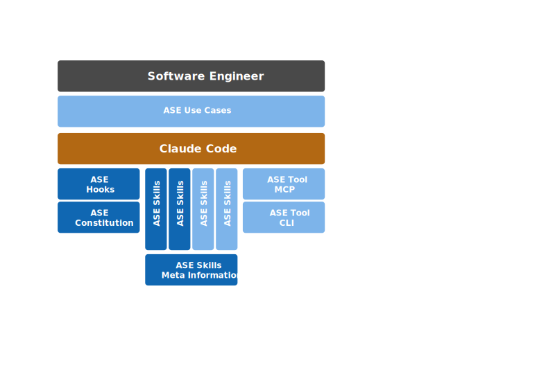

Agentic Software Engineering
============================

https://ase.tools

About
-----

**Agentic Software Engineering (ASE)** is the opinionated companion
tooling of *Dr. Ralf S. Engelschall* for combining the approach of
*Agentic AI* into *Software Engineering* with the help of *Agentic
AI Coding Tools* like *Claude Code*. **ASE** primarily consists of a
*Claude Code* plugin and a Command-Line Interface (CLI) tool. **ASE**
provides skills and commands to support the most important, recurring
work steps in the primary disciplines of *Software Engineering*,
especially in the discipline *Software Development*.

> [!NOTE]
> The initial, primary focus of **ASE** is on the tool *Claude Code* and
> the *TypeScript/JavaScript* technology stack, but the forthcoming,
> secondary focus will be also the tool *Github Copilot CLI* and the
> *Java* technology stack.

> [!CAUTION]
> **ASE** is still under heavy development, still incomplete, partially
> broken and hence not ready for production use. If you are not a
> hard-boiled early adopter, please visit this project again, once we
> reached at least version 0.9.x!

User Setup
----------

### Installation

```
#   install ASE tool
npm install -g @rse/ase
```

```
#   install ASE plugin
claude plugin marketplace add rse/ase
claude plugin install ase@ase
```

### Update

```
#   update ASE tool
npm update -g @rse/ase
```

```
#   update ASE plugin
claude plugin marketplace update ase
claude plugin update ase@ase
```

### Uninstallation

```
#   uninstall ASE tool
npm uninstall -g @rse/ase
```

```
#   uninstall ASE plugin
claude plugin uninstall ase@ase
claude plugin marketplace remove ase
```

<details>

<summary>Contributor Setup</summary>

Contributor Setup
-----------------

### Initial Setup

```
#   clone repository
git clone https://github.com/rse/ase
cd ase

#   build tool
(cd tool && npm install && npm start build)

#   install tool call wrapper
mkdir -p $HOME/bin
(echo "#!/bin/sh"; echo "exec node `pwd`/tool/dst/ase.js \${1+\"$@\"}") >$HOME/bin/ase
chmod 755 $HOME/bin/ase

#   install plugin
claude plugin marketplace add `pwd`
claude plugin install ase@ase
```

### Upgrade Setup (after foreign changes)

```
#   update repository (but keep local modifications)
git stash
git pull
git stash pop

#   re-build tool
(cd tool && npm install && npm start build)

#   re-install plugin
claude plugin uninstall ase@ase
claude plugin install ase@ase
```

### Update Setup (after own local changes)

```
#   re-build tool
(cd tool && npm install && npm start build)

#   re-install plugin
claude plugin uninstall ase@ase
claude plugin install ase@ase
```

</details>

Overview
--------

**ASE** consists of various building blocks:



Usage
-----

### Meta Commands

The following ASE commands/skills exist on the meta-level:

- **/ase-meta-why** *fact*:<br/>
  Perform a Five-Whys root-cause analysis.

- **/ase-meta-search** *query*:<br/>
  Search the Internet/Web with a query.

- **/ase-meta-quorum** *question*:<br/>
  Query multiple AIs for a quorum answer.

- **/ase-meta-llm** *llm* *query*:<br/>
  Query a foreign LLM like OpenAI ChatGPT, Google Gemini, DeepSeek or
  xAI Grok.

### Code Commands

The following ASE commands/skills exist on the code-level:

- **/ase-code-craft** *feature*:<br/>
  Craft source code from scratch.

- **/ase-code-changes**:<br/>
  Update changes entries in `CHANGELOG.md` files from Git commit information.

- **/ase-code-insight**:<br/>
  Give insights into the project.

- **/ase-code-explain** *source-reference*:<br/>
  Explain code with visual diagrams and analogies.

- **/ase-code-analyze** *source-reference*:<br/>
  Analyze the source code for problems in the logic and semantics and
  its related control flow. Usually, for each reported problem you want
  to elaborate on it with `/ase-code-elaborate`.

- **/ase-code-elaborate** *problem-reference*:<br/>
  Elaborate on a source code problem in depth to fix it. Usually the
  problem reference is one of the outputs of `/ase-code-analyze`.

- **/ase-code-refactor** *refactor-hint*:<br/>
  Refactor source code.

- **/ase-code-commit**:<br/>
  Determine commit message for staged Git changes.

- **/ase-code-lint** *source-reference*:<br/>
  Lint the source code in an interactive review loop.

    - **/ase-code-lint:nope**:<br/>
      During lint: reject the last proposed code change and continue
      with the review.

    - **/ase-code-lint:explain** *issue*:<br/>
      During lint: ask the assistant to improve its explanation of the
      last proposed code change.

    - **/ase-code-lint:reassess** *question*:<br/>
      During lint: ask the assistant to re-assess and reason on its
      last proposed code change.

    - **/ase-code-lint:refine** *hint*:<br/>
      During lint: ask the assistant to refine its last proposed code
      change.

    - **/ase-code-lint:complete**:<br/>
      During lint: tell the assistant that its last proposed code change
      set was not complete and ask it to re-propose the entire change set.

    - **/ase-code-lint:recheck**:<br/>
      During lint: tell the assistant that the source code was updated
      externally and ask it to re-propose its last code change against
      the latest source code.

See Also
--------

- [ClaudeX](https://github.com/rse/claudex)

Support
-------

**ASE** is developed in the context of industrial Software Engineering
at the [*msg group*](https://www.msg.group). **ASE** development
is supported by *msg Research*, the organisation of *Dr. Ralf S.
Engelschall*, CTO msg group.

Copyright & License
-------------------

Copyright &copy; 2025-2026 [Dr. Ralf S. Engelschall](https://engelschall.com)<br/>
Licensed under [GPL 3.0](https://spdx.org/licenses/GPL-3.0-only)

