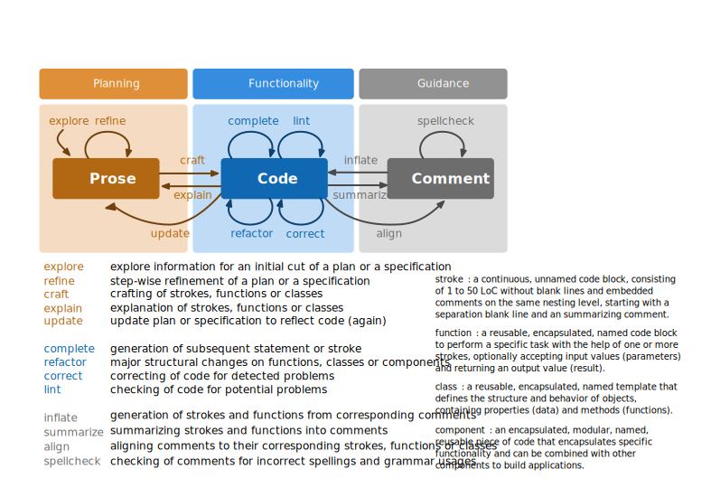

Agentic Software Engineering (ASE)
==================================

About
-----

**Agentic Software Engineering (ASE)** is the opinionated companion
tooling of *Dr. Ralf S. Engelschall* for combining the *Agentic AI
Coding Tooling* into *Software Engineering* with tools like *Claude
Code*. **ASE** primarily consists of a *Claude Code* plugin and a
Command-Line Interface (CLI) tool.

> [!CAUTION]
> **ASE** is still under heavy development, fully incomplete and hence
> not ready for any production use. Visit this repository later, please!

Setup
-----

### Installation

```
#   install ASE tool
npm install -g @rse/ase
```

```
#   install ASE plugin
claude plugin marketplace add rse/ase
claude plugin install ase@ase
```

### Update

```
#   update ASE tool
npm update -g @rse/ase
```

```
#   update ASE plugin
claude plugin marketplace update ase
claude plugin update ase@ase
```

### Uninstallation

```
#   uninstall ASE tool
npm uninstall -g @rse/ase
```

```
#   uninstall ASE plugin
claude plugin uninstall ase@ase
claude plugin marketplace remove ase
```

Overview
--------

**ASE** consists of various building blocks:


Usage
-----

Coding involves the following steps, which are assisted by corresponding
**ASE** commands/skills:



### Meta Commands

The following ASE commands/skills exist on the meta-level:

- `/ase-meta-why <question>`:
  Perform a Five-Whys root-cause analysis.

- `/ase-meta-websearch <query>`:
  Search the Internet/Web with a query.

- `/ase-meta-quorum <question>`:
  Query multiple AIs for a quorum answer.

- `/ase-meta-llm <llm> <query>`:
  Query a foreign LLM like OpenAI ChatGPT, Google Gemini, DeepSeek or
  xAI Grok.

### Code Commands

The following ASE commands/skills exist on the code-level:

- `/ase-code-craft <feature-description>`:
  Craft source code from scratch.

- `/ase-code-changes`:
  Update changes entries in `CHANGELOG.md` files from Git commit information.

- `/ase-code-insight`:
  Give insights into the project.

- `/ase-code-explain <source-reference>`:
  Explain code with visual diagrams and analogies.

- `/ase-code-analyze <source-reference>`:
  Analyze the source code for problems in the logic and semantics and
  its related control flow. Usually, for each reported problem you want
  to elaborate on it with `/ase-code-elaborate`.

- `/ase-code-elaborate <problem-reference>`:
  Elaborate on a source code problem in depth to fix it. Usually the
  problem reference is one of the outputs of `/ase-code-analyze`.

- `/ase-code-lint <source-reference>`:
  Lint the source code in an interactive review loop.

    - `/ase-code-lint:nope`:
      During lint: reject the last proposed code change and continue
      with the review.

    - `/ase-code-lint:explain <issue>`:
      During lint: ask the assistant to improve its explanation of the
      last proposed code change.

    - `/ase-code-lint:reassess <question>`:
      During lint: ask the assistant to re-assess and reason on its
      last proposed code change.

    - `/ase-code-lint:refine <hint>`:
      During lint: ask the assistant to refine its last proposed code
      change.

    - `/ase-code-lint:complete`:
      During lint: tell the assistant that its last proposed code change
      set was not complete and ask it to re-propose the entire change set.

    - `/ase-code-lint:recheck`:
      During lint: tell the assistant that the source code was updated
      externally and ask it to re-propose its last code change against
      the latest source code.

Copyright & License
-------------------

Copyright &copy; 2025-2026 [Dr. Ralf S. Engelschall](https://engelschall.com)<br/>
Licensed under [GPL 3.0](https://spdx.org/licenses/GPL-3.0-only)

