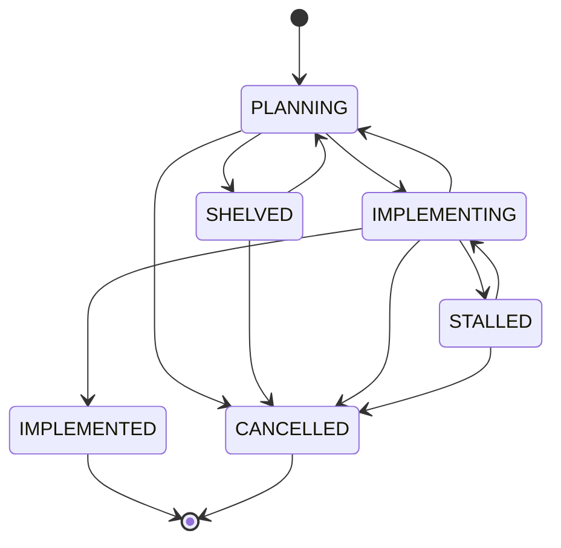
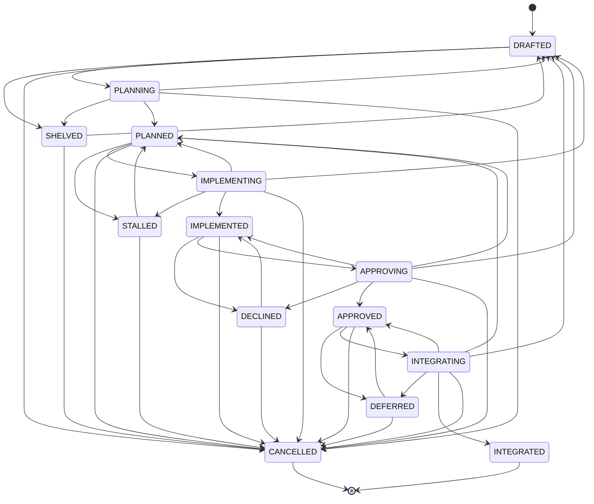

Task Lifecycle Models
---------------------

Every **ASE** *task* carries an optional `Status` frontmatter key, stating its current *lifecycle
state*. When `Status` is absent, the task is in the *default* state of the selected task lifecycle
model.

The lifecycle model is a *state machine*. Whoever sets the `Status` frontmatter key *MUST* only move
along one of the defined state transitions, whereby a *single* operation *MAY* traverse *several*
transitions at once if it performs the corresponding stages in one go.

**ASE** pre-defines two reusable task lifecycle models. The lifecycle model of the current project
is defined by <ase-project-task-lifecycle/>, with allowed values `simple` (default) and `complex`.

### Simple Task Lifecycle Model (`simple`)

The 2+4 states and the transitions between them form the following state machine which realizes a
simple task management scheme based on the two phases Planning and Implementation.



```txt
           ●
           │
           ▼
     ┏━━━━━━━━━━━━┓      ┌────────────┐
┌───▶┃  PLANNING  ┃─────▶│  SHELVED   │
│    ┃            ┃◀─────│            │
│    ┗━━━━━━━━━━━━┛      └────────────┘
│          │    │              │
│          │    └──────────────┴───────────┐
│          ▼                               │
│    ┏━━━━━━━━━━━━┓      ┌────────────┐    │
└────┃IMPLEMENTING┃─────▶│  STALLED   │    │
     ┃            ┃◀─────│            │    │
     ┗━━━━━━━━━━━━┛      └────────────┘    │
           │    │              │           │
           │    └──────────────┴───────────┤
           ▼                               │
     ┌────────────┐      ┌────────────┐    │
     │IMPLEMENTED │      │ CANCELLED  │◀───┘
     │            │      │            │
     └────────────┘      └────────────┘
           │                   │
           ├───────────────────┘
           │
           ▼
           ◉
```

The 2 "activity" states express:

-   `PLANNING`:     task is currently in change planning       (idea to plan).
-   `IMPLEMENTING`: task is currently in change implementation (plan to code-base).

The 4 "rest" states express:

-   `SHELVED`:      task was shelved during planning into backlog.
-   `STALLED`:      task was stalled during implementation by an impediment.
-   `IMPLEMENTED`:  task was implemented and reached its intended outcome.
-   `CANCELLED`:    task was cancelled at any time, because it failed, was called off, or became obsolete.

The *default* state is the "activity" state `PLANNING`.

### Complex Task Lifecycle Model (`complex`)

The 4+10 states and the transitions between them form the following state machine which realizes
a complex task management scheme based on the four phases Planning, Implementation, Approval and
Integration:



```txt
             ●
             │
             │     ┌──────────────────────────────┐
             ▼     │                              │
      ┌──────────────┐       ┌──────────────┐     │
┌────▶│   DRAFTED    │──────▶│   SHELVED    │─────┤
│     │              │◀──────│              │     │
│     └──────────────┘       └──────────────┘     │
│        │       ▲                  ▲             │
│        ▼       │                  │             │
│     ┏━━━━━━━━━━━━━━┓              │             │
│     ┃   PLANNING   ┃──────────────┘             │
│     ┃              ┃────────────────────────────┤
│     ┗━━━━━━━━━━━━━━┛                            │
│            │     ┌──────────────────────────────┤
│            ▼     │                              │
│     ┌──────────────┐       ┌──────────────┐     │
├────▶│   PLANNED    │──────▶│   STALLED    │─────┤
│     │              │◀──────│              │     │
│     └──────────────┘       └──────────────┘     │
│        │       ▲                  ▲             │
│        ▼       │                  │             │
│     ┏━━━━━━━━━━━━━━┓              │             │
├─────┃ IMPLEMENTING ┃──────────────┘             │
│     ┃              ┃────────────────────────────┤
│     ┗━━━━━━━━━━━━━━┛                            │
│            │     ┌──────────────────────────────┤
│            ▼     │                              │
│     ┌──────────────┐       ┌──────────────┐     │
│     │ IMPLEMENTED  │──────▶│   DECLINED   │─────┤
│     │              │◀──────│              │     │
│     └──────────────┘       └──────────────┘     │
│        │       ▲                  ▲             │
│        ▼       │                  │             │
│     ┏━━━━━━━━━━━━━━┓              │             │
├─────┃  APPROVING   ┃──────────────┘             │
│     ┃              ┃────────────────────────────┤
│     ┗━━━━━━━━━━━━━━┛                            │
│            │     ┌──────────────────────────────┤
│            ▼     │                              │
│     ┌──────────────┐       ┌──────────────┐     │
│     │   APPROVED   │──────▶│   DEFERRED   │─────┤
│     │              │◀──────│              │     │
│     └──────────────┘       └──────────────┘     │
│        │       ▲                  ▲             │
│        ▼       │                  │             │
│     ┏━━━━━━━━━━━━━━┓              │             │
└─────┃ INTEGRATING  ┃──────────────┘             │
      ┃              ┃────────────────────────────┤
      ┗━━━━━━━━━━━━━━┛                            │
             │                                    │
             ▼                                    │
      ┌──────────────┐       ┌──────────────┐     │
      │  INTEGRATED  │       │  CANCELLED   │◀────┘
      │              │       │              │
      └──────────────┘       └──────────────┘
             │                      │
             ├──────────────────────┘
             │
             ▼
             ◉
```

The 4 "activity" states express:

-   `PLANNING`:     task is currently in change planning       (idea to plan).
-   `IMPLEMENTING`: task is currently in change implementation (plan to change-set).
-   `APPROVING`:    task is currently in change approval       (change-set to decision).
-   `INTEGRATING`:  task is currently in change integration    (change-set to code-base).

The 10 "rest" states express:

-   `DRAFTED`:      task is still provisional, incoherent and incomplete.
-   `SHELVED`:      task was shelved during planning into backlog.
-   `PLANNED`:      task is coherent and complete and ready for implementation.
-   `STALLED`:      task was stalled during implementation by an impediment.
-   `IMPLEMENTED`:  task is implemented and is ready for approval.
-   `DECLINED`:     task was declined during approval.
-   `APPROVED`:     task is approved and ready for integration.
-   `DEFERRED`:     task was deferred during integration due to release decision.
-   `INTEGRATED`:   task is integrated and reached its intended outcome.
-   `CANCELLED`:    task was cancelled at any time, because it failed, was called off, or became obsolete.

The *default* state is the "rest" state `DRAFTED`.
