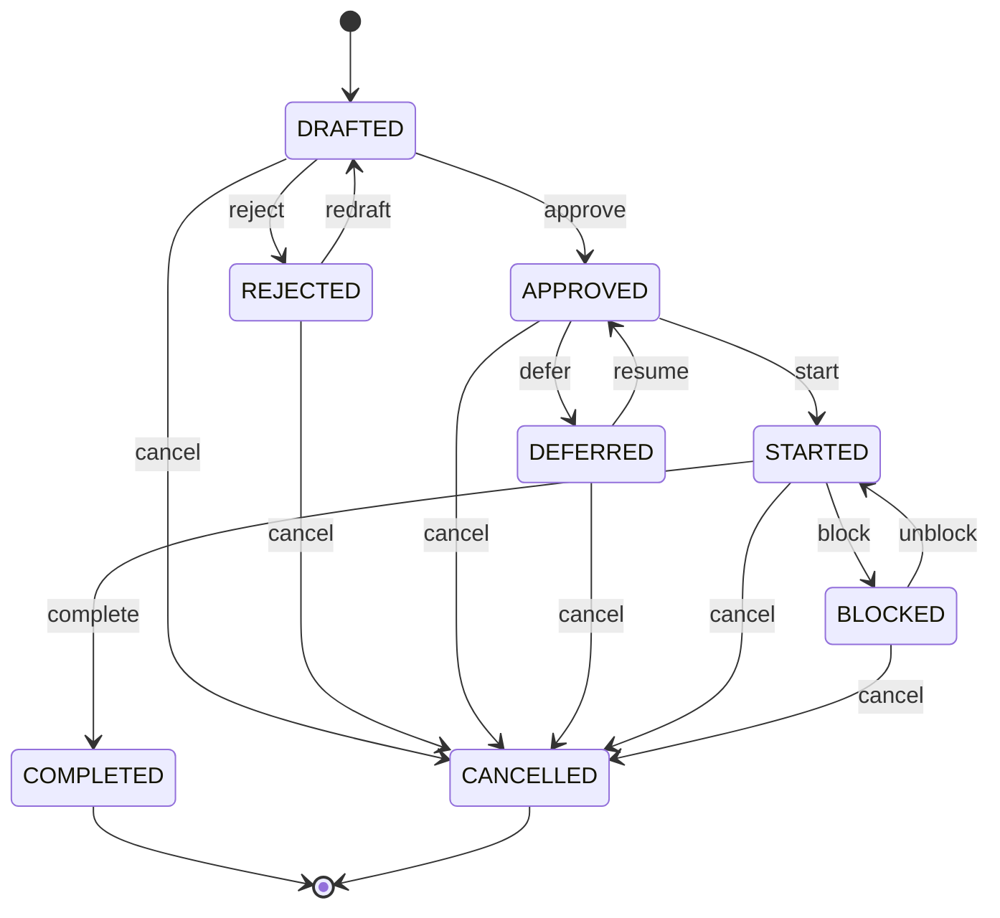

Task Plan States
================

Every **ASE** *task plan* carries a `Status` frontmatter key stating
its current *lifecycle state*. The key is optional and defaults to
`DRAFTED`. The eight states and the transitions between them form the
following state machine:



```txt
          ●
          │
          ▼
    ┌───────────┐   reject   ┌───────────┐
    │  DRAFTED  │───────────▶│ REJECTED  │
    │           │◀───────────│           │
    └─────┬─┬───┘   redraft  └─────┬─────┘
          │ │                      │
  approve │ └──────────────────────┴──────────┐
          ▼                                   │
    ┌───────────┐   defer    ┌───────────┐    │
    │ APPROVED  │───────────▶│ DEFERRED  │    │
    │           │◀───────────│           │    │
    └─────┬─┬───┘   resume   └─────┬─────┘    │
          │ │                      │          │
    start │ └──────────────────────┴──────────┤
          ▼                                   │
    ┌───────────┐   block    ┌───────────┐    │
    │  STARTED  │───────────▶│  BLOCKED  │    │
    │           │◀───────────│           │    │
    └─────┬─┬───┘  unblock   └─────┬─────┘    │
          │ │                      │          │
 complete │ └──────────────────────┴──────────┤
          ▼                                   │
    ┌───────────┐            ┌───────────┐    │
    │ COMPLETED │            │ CANCELLED │◀───┘
    │           │            │           │
    └───────────┘            └───────────┘
          │                        │
          ├────────────────────────┘
          │
          ▼
          ◉
```

The eight states express the following:

-   **DRAFTED**:   plan exists but is still provisional and not yet cleared for implementation.
-   **REJECTED**:  plan was reviewed and refused, and has to be reworked before it can be approved.
-   **APPROVED**:  plan is accepted as authoritative and cleared for implementation, but no work has begun.
-   **DEFERRED**:  plan is approved and unobstructed, but its start was deliberately postponed.
-   **STARTED**:   implementation of the plan is actively underway.
-   **BLOCKED**:   implementation is halted by an impediment that someone has to remove before it can resume.
-   **COMPLETED**: plan was implemented in full and reached its intended outcome.
-   **CANCELLED**: plan was terminated before completion, because it failed, was called off, or became obsolete.

A single operation may traverse *several* transitions at once if it
performs the corresponding stages in one go: `/ase-task-implement` moves
a plan to `COMPLETED` via `start` and `complete`, for instance.

`/ase-task-list` filters by these states through its `--include` and
`--exclude` options, hiding the two terminal states `COMPLETED` and
`CANCELLED` by default.
